# Aegis Kubernetes Framework - Application/Services Flow

```mermaid
graph TB
    subgraph "Infrastructure Foundation"
        AWS[AWS Cloud]
        TF[Terraform Modules]
        AWS --> TF

        TF --> VPC[VPC & Networking<br/>Subnets, NAT, Security Groups]
        TF --> IAM[IAM Roles & Policies<br/>Least Privilege, IRSA]
        TF --> S3[S3 State Store<br/>Backend Configuration]
        TF --> KMS[KMS Encryption<br/>Secrets & Data Encryption]
    end

    subgraph "Cluster Provisioning & Management"
        KOPS[kOps Cluster Creation]
        KOPS --> ETCD[etcd Cluster<br/>Encrypted Volumes]
        KOPS --> API[API Server<br/>RBAC, OIDC Provider]
        KOPS --> NODES[Worker Nodes<br/>Instance Profiles, Auto Scaling]
        KOPS --> CALICO[Calico Networking<br/>Network Policies]
    end

    subgraph "Security Control Plane"
        ISTIO[Istio Service Mesh]
        KYVERNO[Kyverno Policies]
        CERTM[cert-manager]
        TRIVY[Trivy Operator]

        ISTIO --> MTLS[Mutual TLS - STRICT<br/>Zero Trust Communication]
        KYVERNO --> PSA[Pod Security Admission<br/>Restricted by Default]
        KYVERNO --> IMG[Image Verification<br/>Digest Pinning, Signatures]
        CERTM --> CA[Internal Certificate Authority<br/>.local Domains]
        TRIVY --> SCAN[Continuous Vulnerability Scanning<br/>SBOM Generation]
    end

    subgraph "GitOps & Application Management"
        ARGOCD[ArgoCD]
        ARGOCD --> SYNC[Application Synchronization<br/>Git-based Deployments]
        ARGOCD --> OIDC[OIDC Authentication<br/>RBAC Integration]
        ARGOCD --> MONITOR[Deployment Monitoring<br/>Health Checks]
    end

    subgraph "Multi-Cluster Architecture"
        EW[East-West Gateways]
        EW --> FED[Federation<br/>Cross-Cluster Communication]
        EW --> DISC[Service Discovery<br/>Multi-Cluster DNS]
        EW --> LOAD[Load Balancing<br/>Traffic Distribution]
    end

    subgraph "Application Runtime"
        APPS[Containerized Applications]
        APPS --> IRSA[IAM Roles for Service Accounts<br/>Secure AWS Access]
        APPS --> NETPOL[Network Policies<br/>Micro-Segmentation]
        APPS --> SECRETS[Encrypted Secrets<br/>K8s Secrets Encryption]
        APPS --> MONITORING[Application Monitoring<br/>Metrics & Logs]
    end

    subgraph "Validation & Compliance"
        VAL[Validation Scripts]
        VAL --> HEALTH[Cluster Health Checks<br/>Component Validation]
        VAL --> COMPLIANCE[Security Compliance<br/>Policy Verification]
        VAL --> TLS[TLS Certificate Validation<br/>Mutual TLS Testing]
        VAL --> AUDIT[Audit Logging<br/>Security Event Monitoring]
    end

    subgraph "CI/CD Pipeline"
        GHA[GitHub Actions]
        GHA --> TEST[Automated Testing<br/>Unit, Integration, Security]
        GHA --> SCAN[Security Scanning<br/>Code, Dependencies, Images]
        GHA --> BUILD[Build & Sign<br/>Container Images]
        GHA --> DEPLOY[Automated Deployment<br/>GitOps Triggers]
    end

    %% Flow connections
    TF --> KOPS
    KOPS --> ISTIO
    KOPS --> KYVERNO
    KOPS --> CERTM
    KOPS --> TRIVY
    KOPS --> ARGOCD

    ISTIO --> APPS
    KYVERNO --> APPS
    CERTM --> APPS
    TRIVY --> APPS
    ARGOCD --> APPS

    APPS --> EW
    EW --> VAL

    VAL --> TF
    VAL --> KOPS

    GHA --> ARGOCD
    GHA --> VAL

    %% Styling
    style AWS fill:#e3f2fd
    style TF fill:#e8f5e8
    style KOPS fill:#fff3e0
    style ISTIO fill:#fce4ec
    style KYVERNO fill:#fce4ec
    style CERTM fill:#fce4ec
    style TRIVY fill:#fce4ec
    style ARGOCD fill:#f3e5f5
    style EW fill:#e1f5fe
    style APPS fill:#f1f8e9
    style VAL fill:#fff8e1
    style GHA fill:#efebe9

    %% Edge labels
    TF -.->|"Provisions"| KOPS
    KOPS -.->|"Deploys"| ISTIO
    KOPS -.->|"Deploys"| KYVERNO
    KOPS -.->|"Deploys"| CERTM
    KOPS -.->|"Deploys"| TRIVY
    KOPS -.->|"Deploys"| ARGOCD

    ISTIO -.->|"Secures"| APPS
    KYVERNO -.->|"Validates"| APPS
    CERTM -.->|"Provides TLS"| APPS
    TRIVY -.->|"Scans"| APPS
    ARGOCD -.->|"Manages"| APPS

    APPS -.->|"Communicates via"| EW
    EW -.->|"Validated by"| VAL

    VAL -.->|"Feedback to"| TF
    VAL -.->|"Feedback to"| KOPS

    GHA -.->|"Triggers"| ARGOCD
    GHA -.->|"Validates"| VAL
```

## Flow Description

### 1. Infrastructure Foundation
- **AWS Cloud**: Base cloud platform providing compute, storage, and networking
- **Terraform**: Infrastructure as Code for provisioning AWS resources
- **VPC & Networking**: Isolated network environment with security controls
- **IAM**: Identity and access management with least privilege
- **S3 & KMS**: Secure state storage and encryption services

### 2. Cluster Provisioning
- **kOps**: Kubernetes cluster creation and management on AWS
- **etcd**: Distributed key-value store with encryption at rest
- **API Server**: Kubernetes control plane with RBAC and OIDC
- **Worker Nodes**: Compute nodes with auto-scaling and security hardening
- **Calico**: Network plugin providing network policies

### 3. Security Control Plane
- **Istio**: Service mesh for traffic management and security
- **Kyverno**: Policy engine for admission control and validation
- **cert-manager**: Certificate lifecycle management
- **Trivy**: Vulnerability scanning and SBOM generation

### 4. GitOps Management
- **ArgoCD**: Declarative continuous delivery tool
- **Application Sync**: Automated deployment from Git repositories
- **OIDC Integration**: Secure authentication and authorization
- **Monitoring**: Deployment health and status monitoring

### 5. Multi-Cluster Architecture
- **East-West Gateways**: Cross-cluster communication gateways
- **Federation**: Unified management across multiple clusters
- **Service Discovery**: DNS-based service location across clusters
- **Load Balancing**: Traffic distribution and failover

### 6. Application Runtime
- **Containerized Apps**: Secure application deployment
- **IRSA**: IAM roles for service accounts without credentials
- **Network Policies**: Micro-segmentation and traffic control
- **Encrypted Secrets**: Secure secret management
- **Monitoring**: Application performance and health metrics

### 7. Validation & Compliance
- **Validation Scripts**: Automated health and security checks
- **Compliance Testing**: Security policy verification
- **TLS Validation**: Certificate and mutual TLS verification
- **Audit Logging**: Security event monitoring and reporting

### 8. CI/CD Pipeline
- **GitHub Actions**: Automated workflows for testing and deployment
- **Security Scanning**: Code, dependency, and image vulnerability scanning
- **Build & Sign**: Secure container image creation and signing
- **Automated Deployment**: GitOps-based application deployment

## Security Flow Highlights

1. **Secure by Default**: All components start in a secure state
2. **Zero Trust**: Mutual TLS and identity-based authorization
3. **Defense in Depth**: Multiple security layers and controls
4. **Continuous Validation**: Automated security and compliance checks
5. **GitOps Security**: Secure deployment pipelines with validation

This diagram illustrates the complete application and service flow for the Aegis Kubernetes Framework, showing how security is integrated at every layer of the stack.